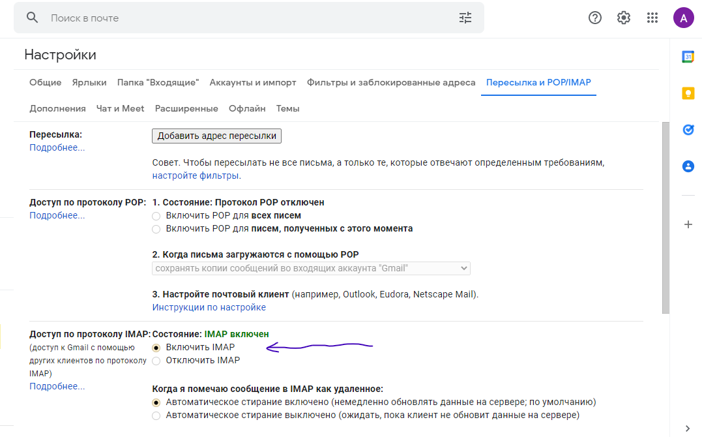
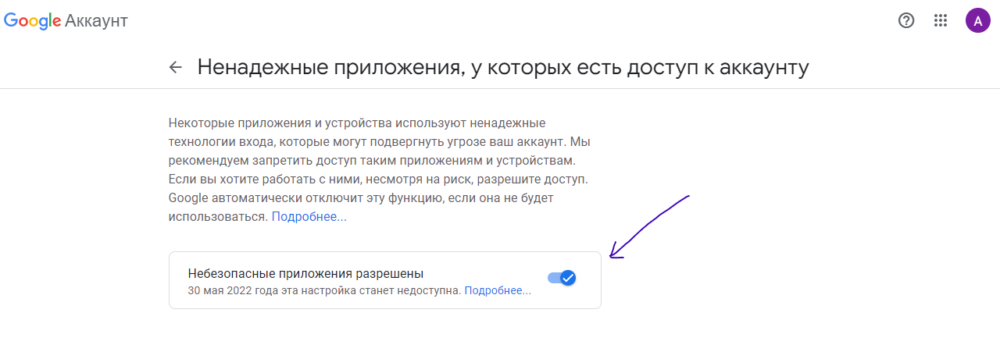
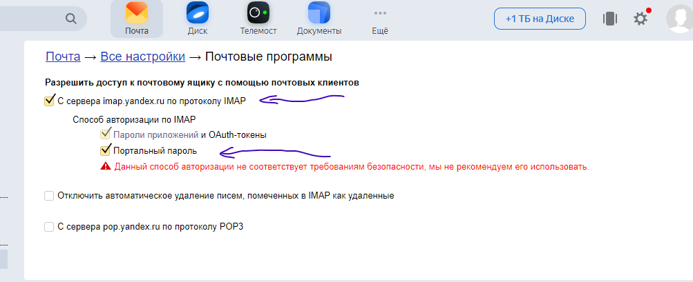
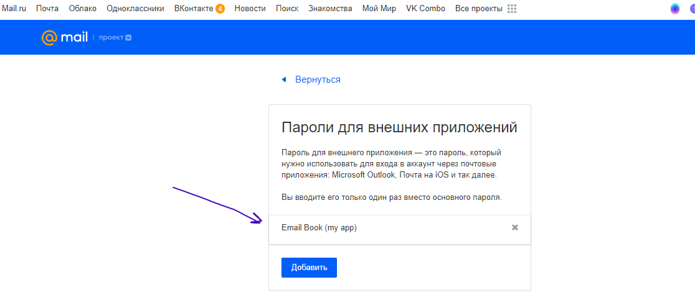

## Правила использования

1. При первом входе нужно выставить некоторые настройки для почты (См раздел по настройкам почт)
2. Зарегистрироваться в Email Book, используя логин и пароль почты (или логин и пароль для внешнего приложения для Mail почты), к которой хотелось бы прикрепить список контактов и с которой далее можно будет отправлять письма.
3. После войти в приложение с использованием этих данных
###### Перед регистрацией обязательно проверить логин и пароль на правильность и ни в коем случае не терять, так как возможность их последующего изменения не реализована в версии 0.1!
---
##### Настройки для почты Gmail
- В настройках почты включить состояние IMAP

- В настройках аккаунта google в разделе безопасности разрешить доступ ненадёжных приложений

##### Настройки для Яндекс.Почты
- В настройках почты включить IMAP и портальный пароль

##### Настройки для почты Mail
- В настройках безопасности почты создать пароль для внешнего приложения. Запомнить его и использовать для регистрации и входа в Email Book для данной почты

---
##### Основные скрипты для запуска
Запускать из папки server
###### `npm run dev` 
Запуск в режиме development (порты 3000, 3001)
###### `npm run prod`
Запуск в режиме production (порт 3001)
